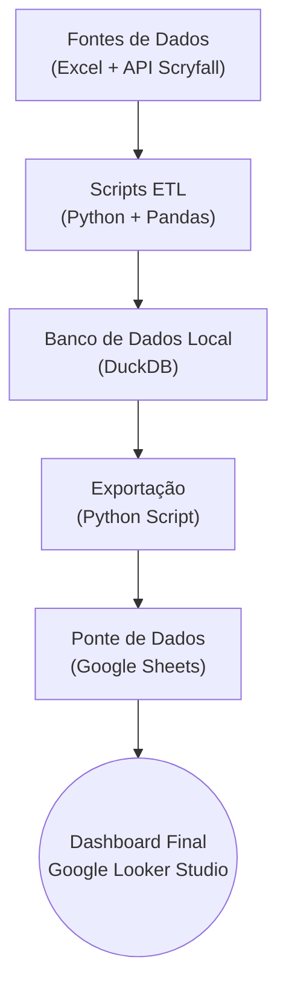

# Projeto de Análise de Estatísticas de MTG Commander


## 📖 Sobre o Projeto

Este projeto é um pipeline de dados desenvolvido para capturar, processar e analisar o histórico de partidas de um grupo de Magic: The Gathering (Commander). O objetivo é transformar um processo manual de registro de dados, baseado em planilhas com formatos variados, em um sistema de dados estruturado e automatizado.

O pipeline extrai dados de comandantes da API pública do Scryfall, processa os dados históricos de jogos a partir de um arquivo Excel, limpa e modela essas informações em um banco de dados local (DuckDB) e prepara os dados para serem consumidos por uma ferramenta de BI, com o objetivo final de criar um dashboard interativo para análise de desempenho e "metagame" do grupo.

## 🛠️ Tech Stack

* **Linguagem Principal:** Python
* **Manipulação de Dados:** Pandas
* **Banco de Dados Local:** DuckDB
* **Fonte de Dados Externa:** Scryfall API
* **Fonte de Dados Históricos:** Microsoft Excel (`.xlsx`)
* **Ponte para BI:** Google Sheets
* **Visualização (BI):** Google Looker Studio *(planejado)*

## 📐 Arquitetura do Pipeline

O diagrama abaixo ilustra o fluxo de dados do projeto, desde as fontes de dados até a camada de visualização final.



## 🚀 Status e Próximos Passos

O projeto está atualmente na transição da Fase 1 para a Fase 3 do nosso plano.

* **Fase 0: Fundação e Estrutura**
    - [x] Ambiente de desenvolvimento configurado (WSL, Git, venv).
    - [x] Estrutura do banco de dados (`schema.sql`) criada e funcional.

* **Fase 1: Carga de Dados Mestres e Históricos**
    - [x] Script `etl_scryfall.py` desenvolvido e populando a `Dim_Comandantes`.
    - [x] Script `etl_historico.py` desenvolvido, processando o Excel e populando as tabelas `Dim_Jogadores`, `Fact_Partidas` e `Fact_Desempenho_Partida`.

* **Fase 2: Automação da Entrada de Novos Dados**
    - [ ] Reestruturar o Google Forms para entrada de dados estruturada.
    - [ ] Desenvolver o script `etl_novas_partidas.py` para processar novos jogos automaticamente.

* **Fase 3: Análise e Visualização (Próximos Passos)**
    - [ ] **Criar a `view` analítica final** no DuckDB para consolidar os dados para o BI.
    - [ ] **Desenvolver o script `export_to_gsheets.py`** para levar os dados da `view` para o Google Sheets.
    - [ ] **Conectar o Google Looker Studio** à planilha.
    - [ ] **Construir o dashboard** com rankings, win rates e outras métricas.

## ⚙️ Como Rodar o Projeto

1.  **Clone o Repositório:**
    ```bash
    git clone [URL_DO_SEU_REPO]
    cd [NOME_DA_PASTA]
    ```
2.  **Configure o Ambiente:**
    ```bash
    python3 -m venv venv
    source venv/bin/activate
    pip install -r requirements.txt
    ```
3.  **Crie o Banco de Dados:**
    ```bash
    python3 create_database.py
    ```
4.  **Popule os Dados Mestres (Comandantes):**
    ```bash
    python3 etl_scryfall.py
    ```
5.  **Processe os Dados Históricos:**
    ```bash
    python3 etl_historico.py
    ```
6.  **Verifique os Dados:**
    * Use o DBeaver ou outra ferramenta para se conectar ao arquivo `banco_mtg.db` e explorar as tabelas populadas.
